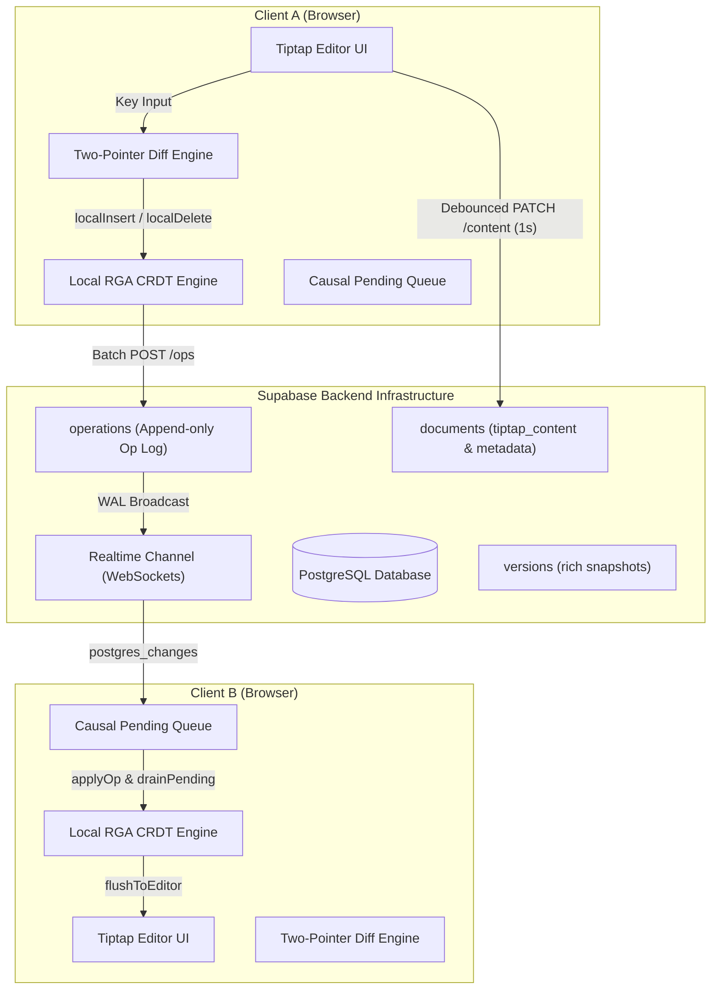
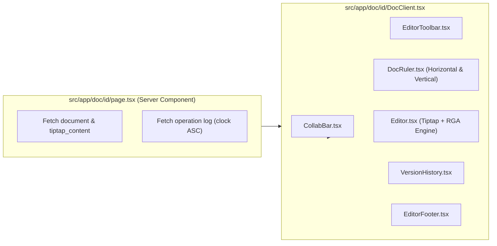
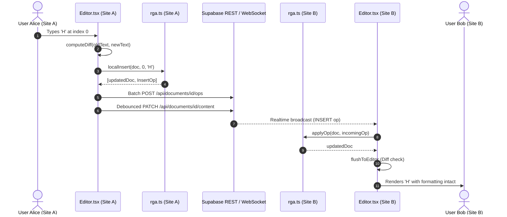
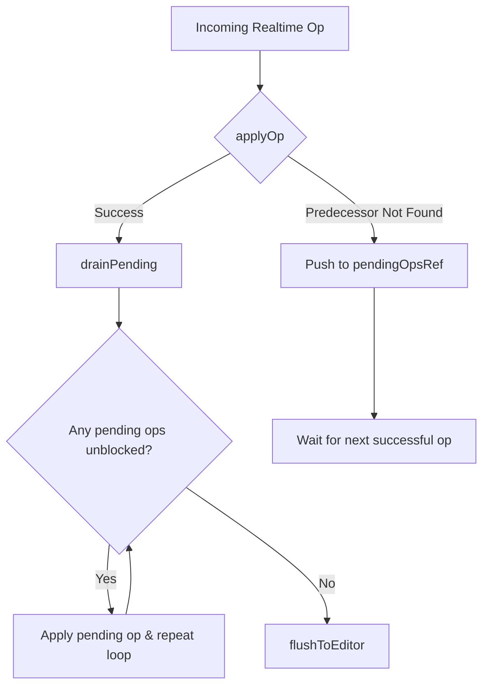
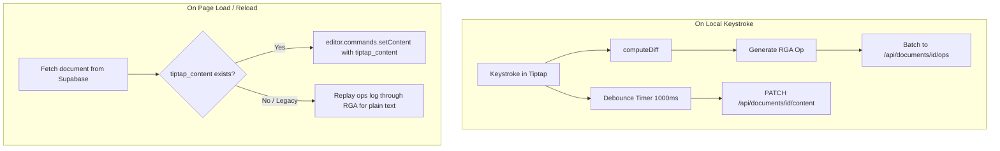
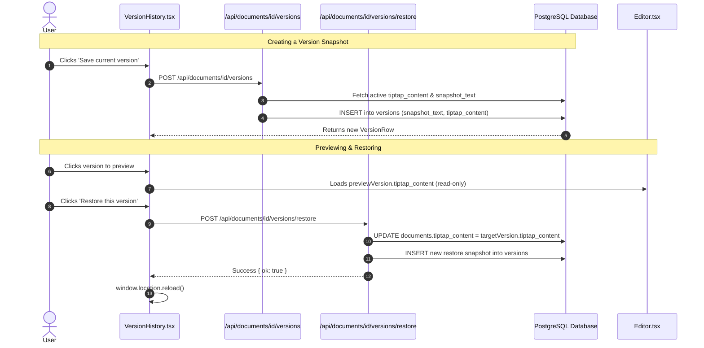

# Mergo 

> **High-Performance Real-Time Collaborative Document Editor powered by Replicated Growable Array (RGA) CRDTs and Tiptap.**

Mergo is a Google Docs-inspired, production-grade collaborative rich text editor built with **Next.js 15**, **Tiptap / ProseMirror**, **Supabase Realtime**, **Clerk Authentication**, and a custom-engineered **RGA Conflict-free Replicated Data Type (CRDT)** engine.

---

## 📑 Table of Contents

- [Mergo ](#mergo-)
  - [ Table of Contents](#-table-of-contents)
  - [ Overview \& Key Highlights](#-overview--key-highlights)
  - [ System Architecture](#️-system-architecture)
    - [1. High-Level Architecture](#1-high-level-architecture)
    - [2. The Two-Tier Split Architecture](#2-the-two-tier-split-architecture)
    - [3. Low-Level Component Architecture](#3-low-level-component-architecture)
  - [🔬 Deep Dive: CRDT \& RGA Data Structures](#-deep-dive-crdt--rga-data-structures)
    - [1. Why RGA (Replicated Growable Array)?](#1-why-rga-replicated-growable-array)
    - [2. Node Structure \& Unique Identification Scheme](#2-node-structure--unique-identification-scheme)
    - [3. Predecessor Anchoring](#3-predecessor-anchoring)
    - [4. Tombstone-Based Deletions](#4-tombstone-based-deletions)
    - [5. Deterministic Conflict Resolution Algorithm](#5-deterministic-conflict-resolution-algorithm)
    - [6. Causal Pending Queue (Out-of-Order Delivery Tolerance)](#6-causal-pending-queue-out-of-order-delivery-tolerance)
    - [7. Minimal Diffing Engine (`computeDiff`)](#7-minimal-diffing-engine-computediff)
  - [📊 System Flowcharts](#-system-flowcharts)
    - [A. Real-Time Collaborative Edit Flow](#a-real-time-collaborative-edit-flow)
    - [B. Causal Pending Queue \& Predecessor Resolution](#b-causal-pending-queue--predecessor-resolution)
    - [C. Two-Tier Persistence \& Lifecycle Flow](#c-two-tier-persistence--lifecycle-flow)
    - [D. Version Snapshot \& Restore Flow](#d-version-snapshot--restore-flow)
  - [ Features \& Capabilities](#-features--capabilities)
    - [1. Interactive Document Margin Rulers](#1-interactive-document-margin-rulers)
    - [2. Typography \& Rich Formatting Toolbar](#2-typography--rich-formatting-toolbar)
    - [3. Live Multi-User Presence \& Awareness](#3-live-multi-user-presence--awareness)
    - [4. Multi-Page Canvas \& Dynamic Page Breaks](#4-multi-page-canvas--dynamic-page-breaks)
    - [5. Version History \& Time Travel](#5-version-history--time-travel)
  - [Project File Structure](#-project-file-structure)
  - [Database Schema \& SQL Migrations](#️-database-schema--sql-migrations)
  - [Getting Started](#️-getting-started)
    - [Prerequisites](#prerequisites)
    - [Environment Variables](#environment-variables)
    - [Installation \& Development](#installation--development)

---

##  Overview & Key Highlights

- **Pure Convergence Without Central Coordination**: Utilizes a formal mathematical CRDT (RGA) allowing users to type, delete, and format simultaneously across network partitions with guaranteed eventual consistency.
- **Two-Tier Split Architecture**: Plaintext character synchronization is governed strictly by the RGA CRDT, while rich formatting attributes (bold, italic, font family, font size, text alignment) are managed via Tiptap ProseMirror JSON payloads.
- **Sub-50ms Latency Realtime Synchronization**: Powered by Supabase Realtime Channels (PostgreSQL WAL changes + WebSocket Broadcasts).
- **Interactive Top & Left Document Margin Rulers**: Draggable margin markers with 1/16" precision snapping, live dimension tooltips, alignment guidelines, and dynamic page padding updates.
- **Zero-Data-Loss Version History**: Instant immutable snapshots with full formatting preservation and zero-friction rollback restores.

---

##  System Architecture

### 1. High-Level Architecture



---

### 2. The Two-Tier Split Architecture

Mergo adopts an architectural pattern similar to **Notion** and modern distributed document engines:

| Layer | Responsibility | Mechanism | Conflict Resolution |
| :--- | :--- | :--- | :--- |
| **Character Sync Layer** | Plain text character insertions & deletions across collaborating peers. | **RGA CRDT (`src/lib/crdt/rga.ts`)** | Deterministic Lamport Timestamps + Site ID tie-breaking. |
| **Formatting Persistence Layer** | Font family, font size, bold, italic, underline, strike, alignment, colors. | **Tiptap ProseMirror JSON (`tiptap_content`)** | Debounced Last-Write-Wins (LWW) per document persisted to PostgreSQL. |

#### Why this separation?
1. **CRDT Simplicity & Performance**: Encoding arbitrary tree-shaped DOM nodes and nested formatting marks directly inside a linear sequence CRDT causes exponential state blowup and complex interleaving anomalies (e.g. split bold tags).
2. **Format Safety**: Tiptap JSON preserves exact formatting semantics (ProseMirror Schema validation).
3. **Resilience**: Even under network disconnects, characters merge flawlessly while rich styling is safely flushed on reconnect.

---

### 3. Low-Level Component Architecture



---

## 🔬 Deep Dive: CRDT & RGA Data Structures

The core CRDT algorithms are located in [`src/lib/crdt/rga.ts`](file:///d:/DJSCE/CODING/mergo/src/lib/crdt/rga.ts).

### 1. Why RGA (Replicated Growable Array)?
Unlike Operational Transformation (OT) which requires a centralized, authoritative server to transform operations against concurrent edits, RGA is a state/operation-based sequence CRDT that guarantees:
- **Strong Eventual Consistency (SEC)**: All replicas that have received the same set of operations will have identical visible text regardless of the order of delivery.
- **Commutativity & Idempotency**: Repeated operations or out-of-order deliveries resolve to the exact same document state.
- **No Intention Inversion**: Characters inserted between two existing characters remain anchored to their intended predecessor.

---

### 2. Node Structure & Unique Identification Scheme

Every character in Mergo is encapsulated in an `RGANode` with a globally unique identifier `NodeID`:

```typescript
export type NodeID = {
  clock: number; // Lamport logical timestamp (monotonically increasing integer)
  site: string;  // Client UUID (generated once per session)
};

export type RGANode = {
  id: NodeID;          // Globally unique node identifier
  char: string;        // Single character (empty string '' for the sentinel head node)
  deleted: boolean;    // Tombstone flag: logically deleted, kept for position tracking
  prev: NodeID | null; // ID of the predecessor node this was inserted after
};

export type RGADocument = {
  nodes: RGANode[];    // Total ordered array of all nodes (including tombstones)
  clock: number;       // Current Lamport clock for this client
  site: string;        // Current client site ID
};
```

---

### 3. Predecessor Anchoring

When a character is inserted at visible index $i$, its logical predecessor is the node at visible index $i - 1$:
- For index $0$, the predecessor is the **Sentinel Node** (`{ clock: 0, site: '' }`).
- Because nodes maintain their `prev` pointer immutably, concurrent insertions in different parts of the document never shift the relative logical anchors of other operations.

```
[ Sentinel Node (0, '') ] ---> [ Node A (1, 'site-1') ] ---> [ Node B (2, 'site-1') ]
                                       ^
                                       | (Inserted with prev = Node A.id)
                              [ Node C (2, 'site-2') ]
```

---

### 4. Tombstone-Based Deletions

In sequence CRDTs, deleting a character immediately from the array would break the causal reference chains of concurrent insertions that target that character as their predecessor (`prev`).

In Mergo:
- `localDelete` and remote `delete` operations mark `deleted = true` (tombstone).
- The node remains in `doc.nodes` to serve as a valid predecessor anchor for concurrent or delayed ops.
- `getVisibleText` filters out all nodes where `deleted === true` or `char === ''`.

---

### 5. Deterministic Conflict Resolution Algorithm

When multiple users insert characters at the exact same position (i.e. having identical `prev` predecessors), RGA resolves the ordering deterministically using the total ordering predicate `idGreaterThan`:

```typescript
function idGreaterThan(a: NodeID, b: NodeID): boolean {
  if (a.clock !== b.clock) return a.clock > b.clock; // 1. Higher Lamport clock wins
  return a.site > b.site;                             // 2. Lexicographical UUID tie-breaker
}
```

#### The `applyOp` Scan Algorithm:
1. **Idempotency Check**: If a node with `(clock, site)` already exists in `doc.nodes`, the op is discarded.
2. **Locate Predecessor**: Find `predIndex` where `node.id == op.node.prev`. If not found, throw a `Predecessor not found` error to trigger buffering in the causal queue.
3. **Scan Rightward Across Concurrent Runs**:
   - Concurrent inserts at the same position form contiguous runs.
   - Scan rightward from `predIndex + 1`.
   - Skip candidate nodes whose predecessor index is $\ge \text{predIndex}$ AND whose `NodeID` beats the incoming node (`idGreaterThan(candidate.id, op.node.id)`).
   - Stop when encountering a node from an earlier subtree or when the incoming node's ID beats the candidate.
4. **Splice & Update Clock**:
   ```typescript
   doc.nodes.splice(insertAt, 0, op.node);
   doc.clock = Math.max(doc.clock, op.node.id.clock) + 1;
   ```

---

### 6. Causal Pending Queue (Out-of-Order Delivery Tolerance)

In distributed environments, Supabase Realtime WebSocket messages or HTTP requests can arrive out of order (e.g. `clock=170` arrives before `clock=169`).

When `applyOp` fails with `Predecessor not found`:
1. The operation is buffered inside `pendingOpsRef.current`.
2. When any subsequent operation successfully applies, `drainPending()` is executed:
   ```typescript
   function drainPending(): void {
     let progress = true;
     while (progress) {
       progress = false;
       const stillPending: RGAOp[] = [];
       for (const pendingOp of pendingOpsRef.current) {
         if (tryApplyOp(pendingOp)) {
           progress = true; // At least one op unblocked — retry the rest!
         } else {
           stillPending.push(pendingOp);
         }
       }
       pendingOpsRef.current = stillPending;
     }
   }
   ```
3. This guarantees that temporary network reordering never corrupts the document or drops keystrokes.

---

### 7. Minimal Diffing Engine (`computeDiff`)

Instead of sending full text payloads on every keystroke, Mergo calculates the minimal operational diff between Tiptap's visible string and the internal RGA state using a bidirectional two-pointer algorithm:

```typescript
function computeDiff(oldText: string, newText: string): DiffResult | null {
  if (oldText === newText) return null;

  let start = 0;
  while (start < oldText.length && start < newText.length && oldText[start] === newText[start]) {
    start++;
  }

  let oldEnd = oldText.length;
  let newEnd = newText.length;
  while (oldEnd > start && newEnd > start && oldText[oldEnd - 1] === newText[newEnd - 1]) {
    oldEnd--;
    newEnd--;
  }

  return {
    start,
    deleted: oldEnd - start,
    insertedChars: newText.slice(start, newEnd).split(""),
  };
}
```

---

## 📊 System Flowcharts

### A. Real-Time Collaborative Edit Flow



---

### B. Causal Pending Queue & Predecessor Resolution



---

### C. Two-Tier Persistence & Lifecycle Flow



---

### D. Version Snapshot & Restore Flow



---

## ✨ Features & Capabilities

### 1. Interactive Document Margin Rulers
Located in [`src/components/DocRuler.tsx`](file:///d:/DJSCE/CODING/mergo/src/components/DocRuler.tsx):
- **Horizontal Top Ruler**: Interactive draggable **Left** and **Right** margin markers.
- **Vertical Left Ruler**: Interactive draggable **Top** and **Bottom** margin markers.
- **Sub-Pixel & Inch Precision**: 1/16" ($6\text{px}$) snapping with live inch tooltips (e.g. `Left Margin: 1.25"`).
- **Visual Alignment Guidelines**: Dynamic dashed guidelines (`#1fb622`) spanning across the document canvas while dragging markers.
- **Live Page Padding**: Automatically updates document padding (`paddingTop`, `paddingBottom`, `paddingLeft`, `paddingRight`) in real-time with zero lag.

---

### 2. Typography & Rich Formatting Toolbar
Located in [`src/components/EditorToolbar.tsx`](file:///d:/DJSCE/CODING/mergo/src/components/EditorToolbar.tsx):
- **Heading Styles**: Normal Text, Heading 1 ($28\text{px}$), Heading 2 ($22\text{px}$), Heading 3 ($18\text{px}$).
- **Font Family Selector**: Inter, Arial, Roboto, Times New Roman, Courier New, Georgia, Montserrat, Poppins, Playfair Display.
- **Font Size Stepper & Dropdown**: Custom font size extension supporting direct values and increment/decrement buttons.
- **Text Styling**: Bold, Italic, Underline, Strikethrough, Text Color Picker, Highlight Color.
- **Text Alignment**: Left, Center, Right, Justify.
- **Lists & Blocks**: Bullet List, Ordered List, Task List, Blockquote, Code Block, Horizontal Rule.

---

### 3. Live Multi-User Presence & Awareness
Located in [`src/components/CollabBar.tsx`](file:///d:/DJSCE/CODING/mergo/src/components/CollabBar.tsx) & [`src/components/RemoteCursors.tsx`](file:///d:/DJSCE/CODING/mergo/src/components/RemoteCursors.tsx):
- Active collaborator avatar stack with live online badges and Clerk user sync.
- Real-time join/leave presence tracking via Supabase Presence channels.

---

### 4. Multi-Page Canvas & Dynamic Page Breaks
- Fixed Standard US Letter dimensions ($816\text{px} \times 1056\text{px}$ at $96\text{ DPI}$).
- Dynamic page break calculation algorithm observing scroll height and rendering visual divider lines.
- Zoom controls with scaling ($50\%$ to $200\%$) in [`src/components/EditorFooter.tsx`](file:///d:/DJSCE/CODING/mergo/src/components/EditorFooter.tsx).
- Real-time word, character, and page count statistics.

---

### 5. Version History & Time Travel
Located in [`src/components/VersionHistory.tsx`](file:///d:/DJSCE/CODING/mergo/src/components/VersionHistory.tsx):
- Grouped by relative date (Today, Yesterday, Month).
- Auto-versioning triggered every 50 local operations.
- Non-destructive rollback restoring full rich formatting without truncating CRDT operation histories.

---

## 📂 Project File Structure

```
mergo/
├── public/                     # Static icons, branding assets, and fonts
├── src/
│   ├── app/
│   │   ├── api/
│   │   │   └── documents/
│   │   │       ├── route.ts                            # GET / POST root document listings
│   │   │       └── [id]/
│   │   │           ├── route.ts                        # GET / PATCH document metadata (rename)
│   │   │           ├── content/
│   │   │           │   └── route.ts                    # PATCH tiptap_content JSON persistence
│   │   │           ├── join/
│   │   │           │   └── route.ts                    # POST collaborator join registration
│   │   │           ├── ops/
│   │   │           │   └── route.ts                    # POST batch append RGA operations
│   │   │           └── versions/
│   │   │               ├── route.ts                    # GET / POST version snapshots
│   │   │               └── [versionId]/
│   │   │                   └── restore/
│   │   │                       └── route.ts            # POST restore version to active document
│   │   ├── dashboard/
│   │   │   ├── layout.tsx                              # Dashboard navigation & layout
│   │   │   └── page.tsx                                # User document list, grid & creation
│   │   ├── doc/
│   │   │   └── [id]/
│   │   │       ├── DocClient.tsx                       # Client-side editor orchestrator
│   │   │       └── page.tsx                            # Server-side doc & ops data loader
│   │   ├── sign-in/[[...sign-in]]/page.tsx             # Clerk Sign In
│   │   ├── sign-up/[[...sign-up]]/page.tsx             # Clerk Sign Up
│   │   ├── globals.css                                 # Core Tailwind & theme styles
│   │   ├── landing.css                                 # Landing page animations & styles
│   │   ├── layout.tsx                                  # Root HTML layout & Clerk Provider
│   │   └── page.tsx                                    # Landing page with hero & CTAs
│   ├── components/
│   │   ├── CollabBar.tsx                               # Top document header & collaborator avatars
│   │   ├── DocRuler.tsx                                # Interactive horizontal & vertical rulers
│   │   ├── Editor.tsx                                  # Core Tiptap + RGA CRDT engine
│   │   ├── EditorFooter.tsx                            # Sticky status bar (zoom, words, pages)
│   │   ├── EditorToolbar.tsx                           # Formatting toolbar (fonts, headings, colors)
│   │   ├── FeatureCards.tsx                            # Landing page feature showcase
│   │   ├── LandingCta.tsx                              # Landing page action banner
│   │   ├── MergoWordmark.tsx                           # SVG branding wordmark
│   │   ├── NewDocButton.tsx                            # Create document button trigger
│   │   ├── RemoteCursors.tsx                           # Remote peer cursor tracking overlay
│   │   ├── ThemeProvider.tsx                           # Dark/Light theme context
│   │   ├── ThemeToggle.tsx                             # Theme switch trigger
│   │   └── VersionHistory.tsx                          # Version history panel & restore UI
│   ├── lib/
│   │   ├── crdt/
│   │   │   └── rga.ts                                  # Complete RGA CRDT implementation
│   │   ├── editor/
│   │   │   └── collab.ts                               # Presence types & collaboration utilities
│   │   ├── supabase/
│   │   │   ├── client.ts                               # Browser Supabase client singleton
│   │   │   └── server.ts                               # Server-side Supabase client singleton
│   │   ├── tiptap/
│   │   │   └── FontSize.ts                             # Custom Tiptap font-size extension
│   │   └── types.ts                                    # Shared document & operation interfaces
│   ├── middleware.ts                                   # Clerk route authentication protection
│   └── types/
│       └── mergo.ts                                    # VersionRow & CollaboratorRow types
├── .env.example                                        # Environment template
├── package.json                                        # Project dependencies & scripts
├── tsconfig.json                                       # TypeScript compiler configuration
└── README.md                                           # Project documentation
```

---

## 🗄️ Database Schema & SQL Migrations

Run the following SQL migration in your **Supabase SQL Editor**:

```sql
-- 1. Documents Table
CREATE TABLE IF NOT EXISTS documents (
  id UUID PRIMARY KEY DEFAULT gen_random_uuid(),
  title TEXT NOT NULL DEFAULT 'Untitled Document',
  created_by TEXT NOT NULL,
  tiptap_content JSONB,
  created_at TIMESTAMPTZ NOT NULL DEFAULT NOW(),
  updated_at TIMESTAMPTZ NOT NULL DEFAULT NOW()
);

-- 2. Operations Table (Append-only CRDT Operation Log)
CREATE TABLE IF NOT EXISTS operations (
  id BIGSERIAL PRIMARY KEY,
  doc_id UUID NOT NULL REFERENCES documents(id) ON DELETE CASCADE,
  op_type TEXT NOT NULL,
  payload JSONB NOT NULL,
  site_id TEXT NOT NULL,
  clock BIGINT NOT NULL,
  created_at TIMESTAMPTZ NOT NULL DEFAULT NOW()
);

CREATE INDEX IF NOT EXISTS idx_ops_doc_clock ON operations(doc_id, clock ASC, id ASC);

-- 3. Versions Table (Immutable Version Snapshots)
CREATE TABLE IF NOT EXISTS versions (
  id UUID PRIMARY KEY DEFAULT gen_random_uuid(),
  doc_id UUID NOT NULL REFERENCES documents(id) ON DELETE CASCADE,
  label TEXT,
  snapshot_text TEXT NOT NULL,
  tiptap_content JSONB,
  created_by TEXT NOT NULL,
  created_by_name TEXT NOT NULL,
  created_by_image TEXT,
  op_cursor BIGINT NOT NULL DEFAULT 0,
  created_at TIMESTAMPTZ NOT NULL DEFAULT NOW()
);

CREATE INDEX IF NOT EXISTS idx_versions_doc ON versions(doc_id, created_at DESC);

-- 4. Collaborators Table
CREATE TABLE IF NOT EXISTS collaborators (
  id UUID PRIMARY KEY DEFAULT gen_random_uuid(),
  doc_id UUID NOT NULL REFERENCES documents(id) ON DELETE CASCADE,
  user_id TEXT NOT NULL,
  user_name TEXT NOT NULL,
  user_image TEXT,
  joined_at TIMESTAMPTZ NOT NULL DEFAULT NOW(),
  last_seen_at TIMESTAMPTZ NOT NULL DEFAULT NOW(),
  UNIQUE(doc_id, user_id)
);

-- 5. Enable Realtime Publications on operations
ALTER PUBLICATION supabase_realtime ADD TABLE operations;
```

---

## 🛠️ Getting Started

### Prerequisites
- Node.js `18.17+` or `20+`
- npm, pnpm, or yarn
- A [Supabase](https://supabase.com) project
- A [Clerk](https://clerk.com) application

---

### Environment Variables

Create a `.env.local` file in the project root:

```bash
# Clerk Authentication
NEXT_PUBLIC_CLERK_PUBLISHABLE_KEY=pk_test_...
CLERK_SECRET_KEY=sk_test_...
NEXT_PUBLIC_CLERK_SIGN_IN_URL=/sign-in
NEXT_PUBLIC_CLERK_SIGN_UP_URL=/sign-up
NEXT_PUBLIC_CLERK_AFTER_SIGN_IN_URL=/dashboard
NEXT_PUBLIC_CLERK_AFTER_SIGN_UP_URL=/dashboard

# Supabase Database & Realtime
NEXT_PUBLIC_SUPABASE_URL=https://your-project.supabase.co
NEXT_PUBLIC_SUPABASE_ANON_KEY=eyJhbGciOi...
SUPABASE_SERVICE_ROLE_KEY=eyJhbGciOi...
```

---

### Installation & Development

```bash
# 1. Clone the repository
git clone https://github.com/akkuraina/mergo.git
cd mergo

# 2. Install dependencies
npm install

# 3. Start local development server
npm run dev
```

Open [http://localhost:3000](http://localhost:3000) in your browser to view Mergo.

